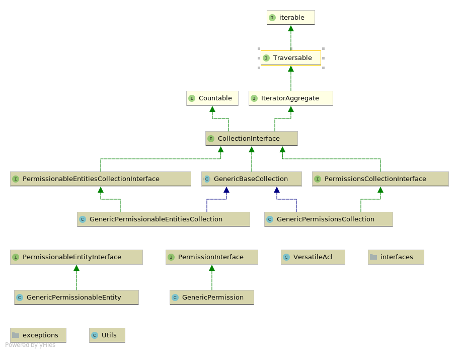
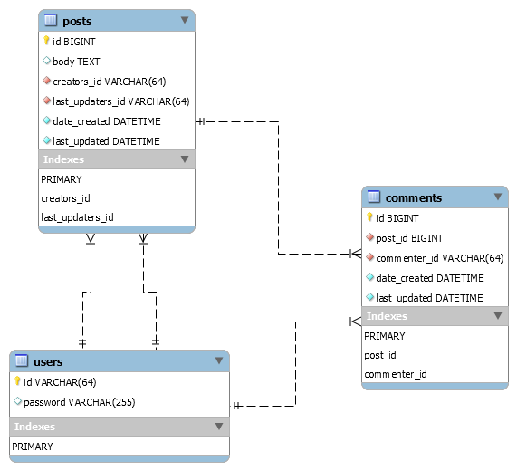

# Versatile Acl

[](https://github.com/rotexsoft/versatile-acl/actions?query=workflow%3A%22Run+PHP+Tests+and+Code+Quality+Tools%22) &nbsp;
[](https://github.com/rotexsoft/versatile-acl/releases/latest) &nbsp; 
[](https://github.com/rotexsoft/versatile-acl/blob/master/LICENSE) &nbsp; 


A simple, highly flexible and customizable access control package for PHP applications.


## Installation 

**Via composer:** (Requires PHP 7.2+ or PHP 8.0+). 

    composer require rotexsoft/versatile-acl

## Introduction
A PHP application can use this package to define **Permissionable Entities** (e.g. application users or groups that users can belong to).
* Each entity is an instance of **[\VersatileAcl\Interfaces\PermissionableEntityInterface](src/interfaces/PermissionableEntityInterface.php)** 
which is implemented by **[\VersatileAcl\GenericPermissionableEntity](src/GenericPermissionableEntity.php)** in this package.
* Each entity can be associated to another entity as a parent Entity. 
* Each entity can have one or more permissions defined. These are **direct permissions**
    * A **permission** in this package is an object that represents whether or not an **action** (represented by a case-insensitive string) can be performed by an entity on a **resource** (represented by a case-insensitive string).
    * A permission is an instance of **[\VersatileAcl\Interfaces\PermissionInterface](src/interfaces/PermissionInterface.php)** which is implemented by 
    **[\VersatileAcl\GenericPermission](src/GenericPermission.php)** in this package.
* Each entity also inherits permissions from its parent entities.
    * The package allows you to give direct permissions a higher priority than inherited permissions (the default behavior) and also allows you to do the reverse, if you so desire.

Below is an overview of the classes in this package:


 
Click [here](class-diagram.png) to see the full Class Diagram for this package.

In your applications, you will be mostly be working with instances of **[VersatileAcl\VersatileAcl](src/VersatileAcl.php)**; this class exposes most of the functionality of the underlying classes in this package listed below: 
* **[\VersatileAcl\GenericPermissionableEntity](src/GenericPermissionableEntity.php) :** Represents an entity in your application

* **[\VersatileAcl\GenericPermissionableEntitiesCollection](src/GenericPermissionableEntitiesCollection.php) :** A collection class for storing one or more entities in your application

* **[\VersatileAcl\GenericPermission](src/GenericPermission.php) :** Represents a permission to be assigned to an entity in your application

* **[\VersatileAcl\GenericPermissionsCollection](src/GenericPermissionsCollection.php) :** A collection class for storing one or more permissions belonging to a particular entity in your application. It is possible to assign the same instance of this class to more than one entity, but it is recommended that you maintain separate instances of this class for each entity in your application.


## Example Real-world Usage

We will be using a blog application that has a users table containing information
about registered blog users (the users in this table are also authors of blog posts and commentators on blog posts in the application), a posts table and a comments table. Below is the schema for the sample application:



Below are the relationship rules for the blog application

* A user can author many posts
* A user can make one or more comments on each post
* A post can have one or more comments associated with it

Below are some access control group definitions that are relevant to this sample blog application:

| Group Name          | Resource | Action  | Allowed |
|---------------------|----------|---------|---------|
| admin               | all      | all     | yes     |
| comments-moderators | comment  | approve | yes     |
| comments-moderators | comment  | delete  | yes     |
| comments-owners     | comment  | all     | yes     |
| posts-moderators    | post     | approve | yes     |
| posts-moderators    | post     | delete  | yes     |
| posts-owners        | post     | all     | yes     |

> **NOTE:** the permissions associated with the **comments-owners** and **posts-owners** will require an assertion callback that further checks that members of the group can only perform actions on the comments or posts they own (not comments and posts owned by other users).

Let's model these groups and permissions using [VersatileAcl\VersatileAcl](src/VersatileAcl.php).

```php
<?php
use VersatileAcl\VersatileAcl;

$groupsSaclObj = new VersatileAcl();

$groupsSaclObj
    ->addEntity('admin')
    
    // | Group Name          | Resource | Action  | Allowed |
    // |---------------------|----------|---------|---------|
    // | admin               | all      | all     | yes     |

    // Permission below will allow an entity whose ID
    // is 'admin' to perform any action on any resource 
    // in an application
    ->addPermission(
      'admin', 
      \VersatileAcl\GenericPermission::getAllActionsIdentifier(), 
      \VersatileAcl\GenericPermission::getAllResourcesIdentifier(),
      true
   );

$groupsSaclObj
    ->addEntity('comments-moderators')
    
    // | Group Name          | Resource | Action  | Allowed |
    // |---------------------|----------|---------|---------|
    // | comments-moderators | comment  | approve | yes     |

    // Permission below allows an entity whose ID is
    // 'comments-moderators' to approve comments made 
    // on a blog post
    ->addPermission('comments-moderators', 'approve', 'comment', true)
    
    // | Group Name          | Resource | Action  | Allowed |
    // |---------------------|----------|---------|---------|
    // | comments-moderators | comment  | delete  | yes     |

    // Permission below allows an entity whose ID is
    // 'comments-moderators' to delete comments made 
    // on a blog post
    ->addPermission('comments-moderators', 'delete', 'comment', true);

$groupsSaclObj
    ->addEntity('posts-moderators')
        
    // | Group Name          | Resource | Action  | Allowed |
    // |---------------------|----------|---------|---------|
    // | posts-moderators    | post     | approve | yes     |

    // Permission below allows an entity whose ID is 
    // 'posts-moderators' to approve any blog post 
    // created in your application
    ->addPermission('posts-moderators','approve', 'post', true)
        
    // | Group Name          | Resource | Action  | Allowed |
    // |---------------------|----------|---------|---------|
    // | posts-moderators    | post     | delete  | yes     |

    // Permission below allows an entity whose ID is 
    // 'posts-moderators' to delete any blog post 
    // created in your application
    ->addPermission('posts-moderators','delete', 'post', true);

// We will create an owners group entity that will
// contain permissions for the comments-owners and
// the posts-owners groups
$groupsSaclObj
    ->addEntity('owners')
    
    // | Group Name          | Resource | Action  | Allowed |
    // |---------------------|----------|---------|---------|
    // | comments-owners     | comment  | all     | yes     |

    // Permission below allows an entity to both  
    // approve and delete comments made on blog 
    // posts created by the entity whose ID is 
    // 'owners'
    ->addPermission(
        'owners', 
        \VersatileAcl\GenericPermission::getAllActionsIdentifier(), 
        'comment', 
        true,
        function(array $userRecord=[], array $commentRecord=[]){

            return isset($userRecord['id'])
                && isset($commentRecord['commenter_id'])
                && $userRecord['id'] === $commentRecord['commenter_id'];
        }
    )

    // | Group Name          | Resource | Action  | Allowed |
    // |---------------------|----------|---------|---------|
    // | posts-owners        | post     | all     | yes     |

    // Permission below allows an entity to both  
    // approve and delete blog posts created by 
    // the entity whose ID is 'owners'
    ->addPermission(
        'owners',
        \VersatileAcl\GenericPermission::getAllActionsIdentifier(), 
        'post', 
        true,
        function(array $userRecord=[], array $blogPostRecord=[]){

            return isset($userRecord['id'])
                && isset($blogPostRecord['creators_id'])
                && $userRecord['id'] === $blogPostRecord['creators_id'];
        }
    );
```
> **NOTE:** \VersatileAcl\GenericPermission::getAllActionsIdentifier() is a special string that represents all actions any entity can perform on each resource in your application.

> **NOTE:** \VersatileAcl\GenericPermission::getAllResourcesIdentifier() is a special string that represents all available resources in your application.


Now that we have created entity objects for each group and added the necessary permissions to the appropriate entity objects, we are ready to go ahead with defining the entity objects that will represent the users below in the blog application. 

Below is a list of userids of users in the application

* frankwhite
* ginawhite
* johndoe
* janedoe
* jackbauer
* jillbauer

Let's create and register entity objects for each user in our **VersatileAcl** object:

```php
<?php

$usersSaclObj = new VersatileAcl(); 
$usersSaclObj->addEntity('frankwhite')
             ->addEntity('ginawhite')
             ->addEntity('johndoe')
             ->addEntity('janedoe')
             ->addEntity('jackbauer')
             ->addEntity('jillbauer');
```

Below are the group membership definitions:

| Group               | User      |
|---------------------|-----------|
| admin               | frankwhite|
| comments-moderators | ginawhite |
| comments-moderators | johndoe   |
| posts-moderators    | janedoe   |
| comments-owners     | all       |
| posts-owners        | all       |

<br>
Let's model these relationships by adding the appropriate entity objects representing the groups as parent entities to the respective user entity objects:

```php
<?php
// add 'frankwhite' to the admin group
$usersSaclObj->getEntity('frankwhite')
             ->addParent(
                $groupsSaclObj->getEntity('admin')
             );

// add 'ginawhite' to the comments-moderators group
$usersSaclObj->getEntity('ginawhite')
             ->addParent(
                $groupsSaclObj->getEntity('comments-moderators')
             );

// add 'johndoe' to the comments-moderators group
$usersSaclObj->getEntity('johndoe')
             ->addParent(
                $groupsSaclObj->getEntity('comments-moderators')
             );

// add 'janedoe' to the posts-moderators group
$usersSaclObj->getEntity('janedoe')
             ->addParent(
                $groupsSaclObj->getEntity('posts-moderators')
             );
    
// Now let's model the two group memberships 
// below for each user
// | Group               | User      |
// |---------------------|-----------|
// | comments-owners     | all       |
// | posts-owners        | all       |
$usersSaclObj->getEntity('frankwhite')
             ->addParent(
                $groupsSaclObj->getEntity('owners')
             ); // frankwhite's membership in the admin group
                // already grants him permission to perform any
                // action on any resource, so this membership is
                // redundant for him
        
$usersSaclObj->getEntity('ginawhite')
             ->addParent(
                $groupsSaclObj->getEntity('owners')
             );
             
$usersSaclObj->getEntity('johndoe')
             ->addParent(
                $groupsSaclObj->getEntity('owners')
             );
             
$usersSaclObj->getEntity('janedoe')
             ->addParent(
                $groupsSaclObj->getEntity('owners')
             );
        
$usersSaclObj->getEntity('jackbauer')
             ->addParent(
                $groupsSaclObj->getEntity('owners')
             );
        
$usersSaclObj->getEntity('jillbauer')
             ->addParent(
                $groupsSaclObj->getEntity('owners')
             );
```

Now that we have set up our groups, users and permissions, let's see how to check if a user is allowed to perform an action on a resource in our application.

Let's start with the user **'frankwhite'** that belongs to the **'admin'**  group. This user should be able to perform any action on any resource in the application:


```php
<?php

var_dump( $usersSaclObj->isAllowed('frankwhite', 'approve', 'comment') ); // === true
var_dump( $usersSaclObj->isAllowed('frankwhite', 'delete', 'comment') ); // === true
var_dump( $usersSaclObj->isAllowed('frankwhite', 'approve', 'post') ); // === true
var_dump( $usersSaclObj->isAllowed('frankwhite', 'delete', 'post') ); // === true
```

Now let's continue with the user **'ginawhite'** that belongs to the **'comments-moderators'**  group. This user should be able to only approve and delete comments in the application (the user should also be able to approve and delete posts they have created):

```php
<?php

var_dump( $usersSaclObj->isAllowed('ginawhite', 'approve', 'comment') ); // === true
var_dump( $usersSaclObj->isAllowed('ginawhite', 'delete', 'comment') ); // === true
var_dump( $usersSaclObj->isAllowed('ginawhite', 'approve', 'post') ); // === false
var_dump( $usersSaclObj->isAllowed('ginawhite', 'delete', 'post') ); // === false

// Assuming we have the post record below and the user record for 'ginawhite' below
$postRecord = [
    'id' => 2,
    'body' => 'Some random post',
    'creators_id' => 'ginawhite',
    'last_updaters_id' => 'ginawhite',
    'date_created' => '2019-08-01 13:43:21',
    'last_updated' => '2019-08-01 13:43:21',
    'is_approved' => '0',
];

$userRecord = [
    'id' => 'ginawhite',
    'password' => 'TydlfEUSqnVMu'
];

// Here's how we would check if 'ginawhite' can approve and delete posts she has created
var_dump( 
    $usersSaclObj->isAllowed(
        'ginawhite', 
        'approve', 
        'post',
        null,
        $userRecord,
        $postRecord
    )
); // === true

var_dump( 
    $usersSaclObj->isAllowed(
        'ginawhite', 
        'delete', 
        'post',
        null,
        $userRecord,
        $postRecord
    )
); // === true
```

Now let's continue with the user **'johndoe'** that belongs to the **'comments-moderators'**  group. This user should be able to only approve and delete comments in the application (the user should also be able to approve and delete posts they have created):

```php
<?php

var_dump( $usersSaclObj->isAllowed('johndoe', 'approve', 'comment') ); // === true
var_dump( $usersSaclObj->isAllowed('johndoe', 'delete', 'comment') ); // === true
var_dump( $usersSaclObj->isAllowed('johndoe', 'approve', 'post') ); // === false
var_dump( $usersSaclObj->isAllowed('johndoe', 'delete', 'post') ); // === false

// Assuming we have the post record below and the user record for 'johndoe' below
$postRecord2 = [
    'id' => 2,
    'body' => 'Some random post',
    'creators_id' => 'johndoe',
    'last_updaters_id' => 'johndoe',
    'date_created' => '2019-08-01 13:43:21',
    'last_updated' => '2019-08-01 13:43:21',
    'is_approved' => '0',
];

$userRecord2 = [
    'id' => 'johndoe',
    'password' => 'TydlfEUSqnVMu'
];

var_dump( 
    $usersSaclObj->isAllowed(
        'johndoe', 
        'approve', 
        'post',
        null,
        $userRecord2,
        $postRecord2
    )
); // === true

var_dump(
    $usersSaclObj->isAllowed(
        'johndoe', 
        'delete', 
        'post',
        null,
        $userRecord2,
        $postRecord2
    )
); // === true
```

Now let's continue with the user **'janedoe'** that belongs to the **'posts-moderators'**  group. This user should be able to only approve and delete posts in the application (the user should also be able to approve and delete comments they have created):

```php
<?php

var_dump( $usersSaclObj->isAllowed('janedoe', 'approve', 'comment') ); // === false
var_dump( $usersSaclObj->isAllowed('janedoe', 'delete', 'comment') ); // === false
var_dump( $usersSaclObj->isAllowed('janedoe', 'approve', 'post') ); // === true
var_dump( $usersSaclObj->isAllowed('janedoe', 'delete', 'post') ); // === true

// Assuming we have the comment record below and the user record for 'janedoe' below
$commentRecord3 = [
    'id' => 1,
    'post_id' => 2,
    'commenter_id' => 'janedoe',
    'comment' => 'Some random comment',
    'date_created' => '2019-08-01 13:43:21',
    'last_updated' => '2019-08-01 13:43:21',
    'is_approved' => '0',
];

$userRecord3 = [
    'id' => 'janedoe',
    'password' => 'TydlfEUSqnVMu'
];

var_dump(
    $usersSaclObj->isAllowed(
        'janedoe', 
        'approve', 
        'comment',
        null,
        $userRecord3,
        $commentRecord3
    )
);  // === true

var_dump(
    $usersSaclObj->isAllowed(
        'janedoe', 
        'delete', 
        'comment',
        null,
        $userRecord3,
        $commentRecord3
    )
); // === true
```

Now let's continue with the user **'jackbauer'** that only belongs to the **'owners'**  group. This user should be able to ONLY approve and delete comments and posts they have created in the application:

```php
<?php
// all comments including those not owned by jackbauer
var_dump( $usersSaclObj->isAllowed('jackbauer', 'approve', 'comment') ); // === false
var_dump( $usersSaclObj->isAllowed('jackbauer', 'delete', 'comment') ); // === false

// all posts including those not owned by jackbauer
var_dump( $usersSaclObj->isAllowed('jackbauer', 'approve', 'post') ); // === false
var_dump( $usersSaclObj->isAllowed('jackbauer', 'delete', 'post') ); // === false

// Assuming we have the post and comment records below and the user record for 'jackbauer' below
$commentRecord5 = [
    'id' => 1,
    'post_id' => 2,
    'commenter_id' => 'jackbauer',
    'comment' => 'Some random comment',
    'date_created' => '2019-08-01 13:43:21',
    'last_updated' => '2019-08-01 13:43:21',
    'is_approved' => '0',
];

$postRecord5 = [
    'id' => 2,
    'body' => 'Some random post',
    'creators_id' => 'jackbauer',
    'last_updaters_id' => 'jackbauer',
    'date_created' => '2019-08-01 13:43:21',
    'last_updated' => '2019-08-01 13:43:21',
    'is_approved' => '0',
];

$userRecord5 = [
    'id' => 'jackbauer',
    'password' => 'TydlfEUSqnVMu'
];

// comment owned by jackbauer
var_dump(
    $usersSaclObj->isAllowed(
        'jackbauer', 
        'approve', 
        'comment',
        null,
        $userRecord5,
        $commentRecord5
    )
); // === true

// comment owned by jackbauer
var_dump(
    $usersSaclObj->isAllowed(
        'jackbauer', 
        'delete', 
        'comment',
        null,
        $userRecord5,
        $commentRecord5
    )
); // === true

// post owned by jackbauer
var_dump(
    $usersSaclObj->isAllowed(
        'jackbauer', 
        'approve', 
        'post',
        null,
        $userRecord5,
        $postRecord5
    )
); // === true

// post owned by jackbauer
var_dump(
    $usersSaclObj->isAllowed(
        'jackbauer', 
        'delete', 
        'post',
        null,
        $userRecord5,
        $postRecord5
    )
); // === true
```

Finally, let's test the user **'jillbauer'** that also only belongs to the **'owners'**  group. This user should be able to ONLY approve and delete comments and posts they have created in the application:

```php
<?php
// all comments including those not owned by jillbauer
var_dump( $usersSaclObj->isAllowed('jillbauer', 'approve', 'comment') ); // === false
var_dump( $usersSaclObj->isAllowed('jillbauer', 'delete', 'comment') ); // === false

// all posts including those not owned by jillbauer
var_dump( $usersSaclObj->isAllowed('jillbauer', 'approve', 'post') ); // === false
var_dump( $usersSaclObj->isAllowed('jillbauer', 'delete', 'post') ); // === false

// Assuming we have the post and comment records below and the user record for 'jackbauer' below
$commentRecord6 = [
    'id' => 1,
    'post_id' => 2,
    'commenter_id' => 'jillbauer',
    'comment' => 'Some random comment',
    'date_created' => '2019-08-01 13:43:21',
    'last_updated' => '2019-08-01 13:43:21',
    'is_approved' => '0',
];

$postRecord6 = [
    'id' => 2,
    'body' => 'Some random post',
    'creators_id' => 'jillbauer',
    'last_updaters_id' => 'jillbauer',
    'date_created' => '2019-08-01 13:43:21',
    'last_updated' => '2019-08-01 13:43:21',
    'is_approved' => '0',
];

$userRecord6 = [
    'id' => 'jillbauer',
    'password' => 'TydlfEUSqnVMu'
];

// comment owned by jillbauer
var_dump(
    $usersSaclObj->isAllowed(
        'jillbauer', 
        'approve', 
        'comment',
        null,
        $userRecord6,
        $commentRecord6
    )
); // === true

// comment owned by jillbauer
var_dump(
    $usersSaclObj->isAllowed(
        'jillbauer', 
        'delete', 
        'comment',
        null,
        $userRecord6,
        $commentRecord6
    )
); // === true

// post owned by jillbauer
var_dump(
    $usersSaclObj->isAllowed(
        'jillbauer', 
        'approve', 
        'post',
        null,
        $userRecord6,
        $postRecord6
    )
); // === true

// post owned by jillbauer
var_dump(
    $usersSaclObj->isAllowed(
        'jillbauer', 
        'delete', 
        'post',
        null,
        $userRecord6,
        $postRecord6
    )
); // === true
```

> **NOTE:** You can override the **$additionalAssertions** callable supplied to **VersatileAcl::addPermission(...)** by passing another callback as the fourth argument to  **VersatileAcl::isAllowed(...)**. In all the examples above, we passed **null** as the fourth argument to **VersatileAcl::isAllowed(...)**, meaning that we want the **$additionalAssertions** callable supplied to **VersatileAcl::addPermission(...)** to be used instead (if present).

This is just an example of how this package can be used to enforce access control in an application. 
You can obviously come up with other more creative ways to adapt this package to your specific use case.

Study the [class diagram](class-diagram.png) for this package to get a better understanding of how the 
various classes interact.

<br>

## Debugging

You can also get information about what's going under the hood of any instance of **[VersatileAcl\VersatileAcl](src/VersatileAcl.php)** by calling **VersatileAcl::enableAuditTrail(bool $canAudit=true)** with a value of **true** and then make calls to other methods on the instance of **[VersatileAcl\VersatileAcl](src/VersatileAcl.php)** and finally echo the contents of the string returned by **VersatileAcl::getAuditTrail()**. 

You can increase or decrease the amount of information returned by **VersatileAcl::getAuditTrail()** by calling **VersatileAcl::enableVerboseAudit(bool $performVerboseAudit=true)** with a value of **true** or **false**.

Finally, you can clear / empty / reset the string returned by **VersatileAcl::getAuditTrail()** by calling  **VersatileAcl::clearAuditTrail()**

Here's an example below:

```php
<?php
$sAcl = new VersatileAcl();

// enable logging of internal activities
$sAcl->enableAuditTrail(true);

// enable verbose logging of internal activities
$sAcl->enableVerboseAudit(true); 

// call some methods
$sAcl->addEntity('jblow');
$sAcl->removeEntity('jblow');

echo 'Outputing verbose Audit Trail: ' . PHP_EOL . PHP_EOL;
echo $sAcl->getAuditTrail();

// Clear the contents of the audit trail
$sAcl->clearAuditTrail();

// disable verbose logging of internal activities
$sAcl->enableVerboseAudit(false); 

// call some methods
$sAcl->addEntity('jblow');
$sAcl->removeEntity('jblow');

echo 'Outputing non-verbose Audit Trail: ' . PHP_EOL . PHP_EOL;
echo $sAcl->getAuditTrail();
```

Produces the output below:

```
Outputing verbose Audit Trail:

[2020-12-04 13:51:06]: Entered VersatileAcl\VersatileAcl::addEntity('jblow') trying to create and add a new entity whose ID will be `jblow`


[2020-12-04 13:51:06]: Entity created


[2020-12-04 13:51:06]: Successfully added the following entity:
VersatileAcl\GenericPermissionableEntity (0000000038640cc1000000007974da68)
{
        id: `jblow`
        parentEntities:
                VersatileAcl\GenericPermissionableEntitiesCollection (0000000038640cdf000000007974da68)
                {

                }

        permissions:
                VersatileAcl\GenericPermissionsCollection (0000000038640cc0000000007974da68)
                {

                }


}


[2020-12-04 13:51:06]: Exiting VersatileAcl\VersatileAcl::addEntity('jblow')


[2020-12-04 13:51:06]: Entered VersatileAcl\VersatileAcl::removeEntity('jblow') trying to remove the entity whose ID is `jblow`


                [2020-12-04 13:51:06]: Entered VersatileAcl\VersatileAcl::getEntity('jblow') trying to retrieve the entity whose ID is `jblow`


                [2020-12-04 13:51:06]: Retrieved the following item: VersatileAcl\GenericPermissionableEntity (0000000038640cc1000000007974da68)
                {
                        id: `jblow`
                        parentEntities:
                                VersatileAcl\GenericPermissionableEntitiesCollection (0000000038640cdf000000007974da68)
                                {

                                }

                        permissions:
                                VersatileAcl\GenericPermissionsCollection (0000000038640cc0000000007974da68)
                                {

                                }


                }


                [2020-12-04 13:51:06]: Exiting VersatileAcl\VersatileAcl::getEntity('jblow') with a return type of `object` that is an instance of `VersatileAcl\GenericPermissionableEntity` with the following string rep
resentation:
                VersatileAcl\GenericPermissionableEntity (0000000038640cc1000000007974da68)
                {
                        id: `jblow`
                        parentEntities:
                                VersatileAcl\GenericPermissionableEntitiesCollection (0000000038640cdf000000007974da68)
                                {

                                }

                        permissions:
                                VersatileAcl\GenericPermissionsCollection (0000000038640cc0000000007974da68)
                                {

                                }


                }


[2020-12-04 13:51:06]: Successfully removed the entity whose ID is `jblow`.


[2020-12-04 13:51:06]: Exiting VersatileAcl\VersatileAcl::removeEntity('jblow') with a return type of `object` that is an instance of `VersatileAcl\GenericPermissionableEntity` with the following string representation:
VersatileAcl\GenericPermissionableEntity (0000000038640cc1000000007974da68)
{
        id: `jblow`
        parentEntities:
                VersatileAcl\GenericPermissionableEntitiesCollection (0000000038640cdf000000007974da68)
                {

                }

        permissions:
                VersatileAcl\GenericPermissionsCollection (0000000038640cc0000000007974da68)
                {

                }


}


Outputing non-verbose Audit Trail:

[2020-12-04 13:51:06]: Entered VersatileAcl\VersatileAcl::addEntity('jblow')


[2020-12-04 13:51:06]: Entity created


[2020-12-04 13:51:06]: Successfully added the entity whose ID is `jblow`


[2020-12-04 13:51:06]: Exiting VersatileAcl\VersatileAcl::addEntity('jblow')


[2020-12-04 13:51:06]: Entered VersatileAcl\VersatileAcl::removeEntity('jblow')


                [2020-12-04 13:51:06]: Entered VersatileAcl\VersatileAcl::getEntity('jblow')


                [2020-12-04 13:51:06]: Successfully retrieved the desired entity.


                [2020-12-04 13:51:06]: Exiting VersatileAcl\VersatileAcl::getEntity('jblow')


[2020-12-04 13:51:06]: Successfully removed the entity whose ID is `jblow`.


[2020-12-04 13:51:06]: Exiting VersatileAcl\VersatileAcl::removeEntity('jblow')

```


<br>

## Public Methods of **[VersatileAcl\VersatileAcl](src/VersatileAcl.php)**
| Method | Description |
|--------|-------------|
| **__construct( <br> &nbsp;&nbsp;&nbsp;string $permissionableEntityInterfaceClassName = GenericPermissionableEntity::class, <br> &nbsp;&nbsp;&nbsp;string $permissionInterfaceClassName = GenericPermission::class, <br> &nbsp;&nbsp;&nbsp;string $permissionableEntitiesCollectionInterfaceClassName = GenericPermissionableEntitiesCollection::class, <br> &nbsp;&nbsp;&nbsp;string $permissionsCollectionInterfaceClassName = GenericPermissionsCollection::class <br>)** | The constructor through which you can specify alternate fully qualified class names of classes that implement **[PermissionableEntityInterface](src/interfaces/PermissionableEntityInterface.php)**, **[PermissionInterface](src/interfaces/PermissionInterface.php)**, **[PermissionableEntitiesCollectionInterface](src/interfaces/PermissionableEntitiesCollectionInterface.php)** and **[PermissionsCollectionInterface](src/interfaces/PermissionsCollectionInterface.php)** .|
| **addEntity(string $entityId): self** | Adds an entity to an instance of this class if it doesn't already exist. Entity IDs are treated in a case-insensitive manner, meaning that 'ALice' and 'alicE' both refer to the same entity |
| **addParentEntity(string $entityId, string $parentEntityId): self** | Add an entity with an ID value of $parentEntityId as a parent entity to another entity with an ID value of $entityId in an instance of this class. <br> If an entity with an ID value of $entityId does not exist in the instance of this class upon which this method is called, the entity will be created and added first before the parent entity is added to it. <br>Both IDs are treated in a case-insensitive manner, meaning that if **$entityId** has a value of 'ALice' or 'alicE' both will refer to the same entity or if **$parentEntityId** has a value of 'ALice' or 'alicE' both will refer to the same parent entity. <br> You can use this method as a shortcut to creating both an entity and its associated parent entities, eliminating the need for calling **addEntity** first before calling this method. |
| **addPermission( <br> &nbsp;&nbsp;&nbsp;string $entityId, <br> &nbsp;&nbsp;&nbsp;string $action, <br> &nbsp;&nbsp;&nbsp;string $resource, <br> &nbsp;&nbsp;&nbsp;bool $allowActionOnResource = true, <br> &nbsp;&nbsp;&nbsp;callable $additionalAssertions = null, <br> &nbsp;&nbsp;&nbsp;...$argsForCallback <br>): self** | Used for adding a permission to an entity with the specified ID. If the entity does not exist, it will be created and the permission will be added to it. <br>See **__construct** in **[PermissionInterface](src/interfaces/PermissionInterface.php)** for more information about all the parameters to this method (except the first). You should provide default values for each parameter to your $additionalAssertions callback function. |
| **clearAuditTrail(): self** | Empties the contents of the Audit Trail containing the trace of all logged internal activities. |
| **createEntity(string $entityId): PermissionableEntityInterface** | A helper method for creating entity objects which you would be responsible for managing outside of this class. You would not normally need to use this method except if you want to more control over how the entities and permissions in your application are managed. |
| **createEntityCollection(): PermissionableEntitiesCollectionInterface** | A helper method for creating collection objects used to store entity objects which you would be responsible for managing outside of this class. You would not normally need to use this method except if you want to more control over how the entities and permissions in your application are managed. |
| **createPermission( <br>&nbsp;&nbsp;&nbsp;string $action, <br>&nbsp;&nbsp;&nbsp;string $resource, <br>&nbsp;&nbsp;&nbsp;bool $allowActionOnResource = true, <br>&nbsp;&nbsp;&nbsp;callable $additionalAssertions = null, <br>&nbsp;&nbsp;&nbsp;...$argsForCallback <br>): PermissionInterface** | A helper method for creating permission objects which you would be responsible for managing outside of this class. You would not normally need to use this method except if you want to more control over how the entities and permissions in your application are managed. <br>See **__construct** in **[PermissionInterface](src/interfaces/PermissionInterface.php)** for more information about the parameters to this method.|
| **createPermissionCollection(): PermissionsCollectionInterface** | A helper method for creating collection objects used to store permission objects which you would be responsible for managing outside of this class. You would not normally need to use this method except if you want to more control over how the entities and permissions in your application are managed. |
| **enableAuditTrail(bool $canAudit=true): self** | Enables or disables the logging of internal activities performed in some of the important public methods of this class. |
| **enableVerboseAudit(bool $performVerboseAudit=true): self** | Enables or disables verbose logging of internal activities performed in some of the important public methods of this class. This method only increases or decreases the level of detail of the internal activities that are logged. It does not not disable logging. |
| **getAllEntities() : ?PermissionableEntitiesCollectionInterface** | Returns a collection of all entities added to an instance of this class or null if the collection has not yet been initialized. |
| **getAuditTrail(): string** | Returns a string containing a trace of all logged internal activities performed in some of the important public methods of this class. |
| **getEntity(string $entityId): ?PermissionableEntityInterface** | Gets and returns an entity with specified Id from an instance of this class or returns NULL if an entity with specified Id doesn't already exist. |
| **isAllowed(<br>&nbsp;&nbsp;&nbsp;string $entityId, <br> &nbsp;&nbsp;&nbsp;string $action, <br> &nbsp;&nbsp;&nbsp;string $resource, <br> &nbsp;&nbsp;&nbsp;callable $additionalAssertions = null, <br> &nbsp;&nbsp;&nbsp;...$argsForCallback <br>): bool** | Check if the specified action in **$action** can be performed on the specified resource in **$resource** based on the existing permissions associated with either the specified entity with an ID value in **$entityId** or all entities associated with the instance  of this class this method is being invoked on if **$entityId** === ''. <br>See **PermissionInterface::isAllowed($action, $resource, $additionalAssertions, ...$argsForCallback)** for definitions of all but the first parameter. |
| **removeEntity(string $entityId): ?PermissionableEntityInterface** | Removes an entity from an instance of this class if it exists and returns the removed entity or NULL if the entity does not exist. |
| **removeParentEntity(<br>&nbsp;&nbsp;&nbsp;string $entityId, <br>&nbsp;&nbsp;&nbsp;string $parentEntityId <br>): ?PermissionableEntityInterface** | Remove and return an entity with an ID value in **$parentEntityId** that is a parent entity to another entity with an ID value in **$entityId**, if the instance of this class upon which this method is being called contains an entity with the ID value in **$entityId**, else NULL is returned. |
| **removePermission(<br>&nbsp;&nbsp;&nbsp;string $entityId, <br> &nbsp;&nbsp;&nbsp;string $action, <br> &nbsp;&nbsp;&nbsp;string $resource, <br> &nbsp;&nbsp;&nbsp;bool $allowActionOnResource = true, <br> &nbsp;&nbsp;&nbsp;callable $additionalAssertions = null, <br> &nbsp;&nbsp;&nbsp;...$argsForCallback <br>): ?PermissionInterface** | Remove a permission from the entity with an ID value specified in **$entityId** and return the removed permission or return null if either the entity and / or permission do not exist. |
