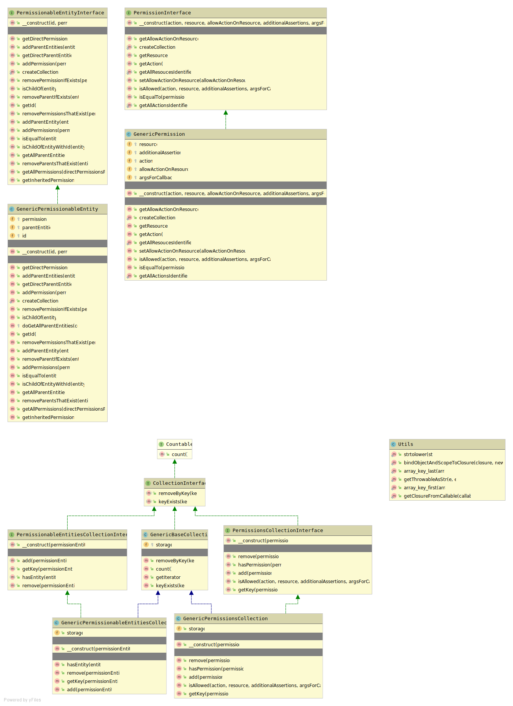

# simple-acl
A simple and highly flexible and customizable access control library for PHP 

Entities
----------
* **Resource:** an item on which an **action** will be denied or allowed to be performed on.
It is just a case-insensitive string as far as this package is concerned.

* **Action:** represents a task that can be performed on a **resource**. 
It is just a case-insensitive string as far as this package is concerned.

* **Permission:** an object defining whether or not a **PermissionableEntity** 
is allowed or not allowed to perform an **action** on a particular **resource**.
This object will allow additional assertions (to test if a **PermissionableEntity**
 is allowed or not allowed to perform an **action** on a particular **resource**) to 
 be injected via a callback.

* **PermissionableEntity:** has one or more unique **permissions** and can have one or more other unique 
**PermissionableEntities** related to it as parents and consequently inherit permissions from its parent 
relations. Each parent can have parents and those parents can in turn have parents and so on. An entity 
cannot become a parent of another entity that is already its parent. Each parent of a **PermissionableEntity** 
must have a unique id value. Permissions directly associated with an entity have higher priority than those 
inherited from parent related entities. Each entity must have a unique case-insensitive string identifier (an
Entities Repository maybe introduced to guarantee this uniqueness). A **permission** is unique to a 
**PermissionableEntity** if it is the only permission associated with the entity having a specific 
**action** and **resource** value pair. In a real world application an entity can represent various 
things such as a user or a group (that users can belong to).
 


## Example Usage

```
<?php
use \SimpleAcl\GenericPermission;
use \SimpleAcl\GenericPermissionableEntity;

$user_entity = new GenericPermissionableEntity('aadegbam');
$group_entity = new GenericPermissionableEntity('admin');

$group_entity->addPermission(new GenericPermission('browse', 'blog'))
             ->addPermission(new GenericPermission('read', 'blog'))
             ->addPermission(new GenericPermission('edit', 'blog')) 
             ->addPermission(new GenericPermission('add', 'blog'))
             ->addPermission(new GenericPermission('delete', 'blog'));

$user_entity->addParentEntity($group_entity);

var_dump(
    $user_entity->getPermissions()->isActionAllowedOnResource('browse', 'blog')
); // returns false

var_dump(
    $user_entity->getInheritedPermissions()->isActionAllowedOnResource('browse', 'blog')
); // returns true

$user_entity->addPermission(new GenericPermission('browse', 'blog'));

var_dump(
    $user_entity->getPermissions()->isActionAllowedOnResource('browse', 'blog')
); // returns true
```
